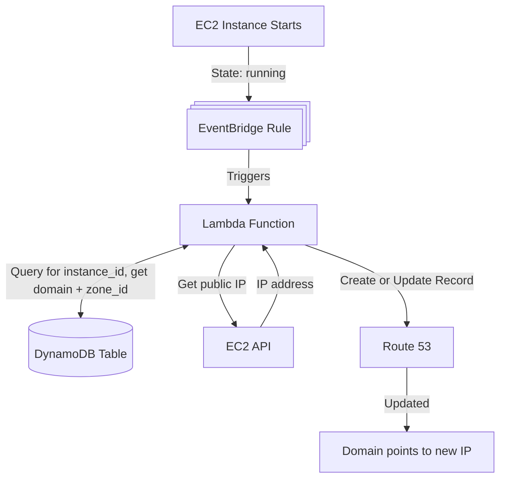

# EC2 DNS Update

Automatically updates Route 53 DNS A records when EC2 instances start.

## TLDR Process Flow



This solution monitors EC2 instance state changes spefically in **eu-west-2** (hardcoded for now for convenience) and automatically updates Route 53 DNS records when instances transition to the 'running' state.

### Components

1. **DynamoDB Table**: Stores mappings between EC2 instance IDs and their corresponding domain names and Route 53 hosted zone IDs
2. **Lambda Function**: Triggered by EventBridge when an instance starts. Looks up the domain mapping, retrieves the instance's public IP, and updates the Route 53 A record
3. **EventBridge Rule**: Monitors EC2 instance state changes and triggers the Lambda function when instances enter the 'running' state

### Region Configuration

This stack is deployed to **eu-west-2** where the EC2 instances are located. The Lambda function monitors instances in this region only.

If you need to monitor instances in other regions, you would need to either:
- Deploy this stack to each region, OR
- Set up cross-region EventBridge event forwarding

## DynamoDB Table Structure

The mapping table uses the following schema:

- **Partition Key**: `instance_id` (String) - The EC2 instance ID (e.g., `i-1234567890abcdef0`)
- **Attributes**:
  - `domain_name` (String) - The fully qualified domain name (e.g., `server.example.com`)
  - `hosted_zone_id` (String) - The Route 53 hosted zone ID (e.g., `Z1234567890ABC`)

### Example Item

```json
{
  "instance_id": "i-1234567890abcdef0",
  "domain_name": "server.example.com",
  "hosted_zone_id": "Z1234567890ABC"
}
```

## Setup

1. Install dependencies:
   ```bash
   npm install
   ```

2. Deploy the stack:
   ```bash
   npx cdk deploy
   ```

3. Populate the DynamoDB table with your instance-to-domain mappings using the AWS CLI or Console.

## Populating the DynamoDB Table

After deployment, add your instance mappings to the DynamoDB table either with the `scripts/add-mapping.sh` script, or with the AWS CLI directly:

```bash
aws dynamodb put-item \
  --table-name <DnsMappingTableName> \
  --item '{
    "instance_id": {"S": "i-1234567890abcdef0"},
    "domain_name": {"S": "server.example.com"},
    "hosted_zone_id": {"S": "Z1234567890ABC"}
  }' \
  --region eu-west-2
```

Replace:
- `<DnsMappingTableName>` with the table name from the stack outputs
- `i-1234567890abcdef0` with your EC2 instance ID
- `server.example.com` with your domain name
- `Z1234567890ABC` with your Route 53 hosted zone ID

## Configuration

- **DNS Record TTL**: Default is 60 seconds. Can be modified in the stack by changing the `RECORD_TTL` environment variable.

## How It Works

1. An EC2 instance in eu-west-2 starts and transitions to the 'running' state
2. EventBridge detects the state change and triggers the Lambda function
3. Lambda receives the instance ID from the event
4. Lambda queries DynamoDB to check if a mapping exists for this instance
5. If a mapping exists, Lambda calls the EC2 API to get the instance's public IP address
6. Lambda updates the Route 53 A record to point to the new IP address
7. All actions are logged to CloudWatch Logs with X-Ray tracing enabled

## Utilities

There is a bunch of stuff in the `./scripts` folder to make things a little easier:

- `add-mapping.sh` adds a record to the ddb table
- `analyze-bundle.sh` measures the size of the lambda function bundle. I had to explicitly exclude `@aws-sdk/*`, for which version 3 and above is automatically bundles with Node 20+ runtimes on AWS. This reduced the bundle size from 3.5mb to 2.2kb (lol)
- `watch-dns.sh` monitors both public DNS and a Route53 record to check that updates have been applied and propagated (useful when testing an instance launch to ensure things are working)
